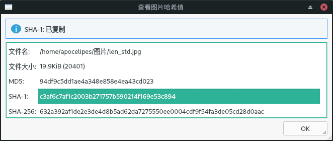

# pHashChecker

A GUI tool using libpHash to search similar images in your system.

Make sure you have installed Qt 6.5.0+ in your system.

## Install

```bash
# for Ubuntu
sudo apt install qt6-* qtchooser
qtchooser -install qt6 $(which qmake6)

# building pHashChecker
git clone --recurse-submodules https://github.com/apocelipes/pHashChecker
cd pHashChecker
mkdir build && cd build
cmake ..
make

# running
./pHashChecker
```

To support AVIF images, you need to install `libheif` in your system:

```bash
# Ubuntu
sudo apt install libheif1 libheif-dev

# Arch Linux
sudo pacman -S libheif
```

To support WebP images, you need to install `libwebp`:

```bash
# Ubuntu
sudo apt install libwebp-dev

# Arch Linux
sudo pacman -S libwebp
```

To support JPEG XL images, you need to install 'libjxl':

```bash
# Ubuntu
sudo apt-get install libjxl-dev

# Arch Linux
sudo pacman -S libjxl
```

In addition, it's better to install `imagemagick` on your system:

```bash
# Ubuntu
sudo apt install imagemagick

# Arch Linux
sudo pacman -S imagemagick
```

For macOS, you should install homebrew, then run:

```bash
brew install libpng
brew install libheif
brew install qt
brew install imagemagick
```

## Screenshots





## TODO

- [ ] unit testing
- [ ] more settings
